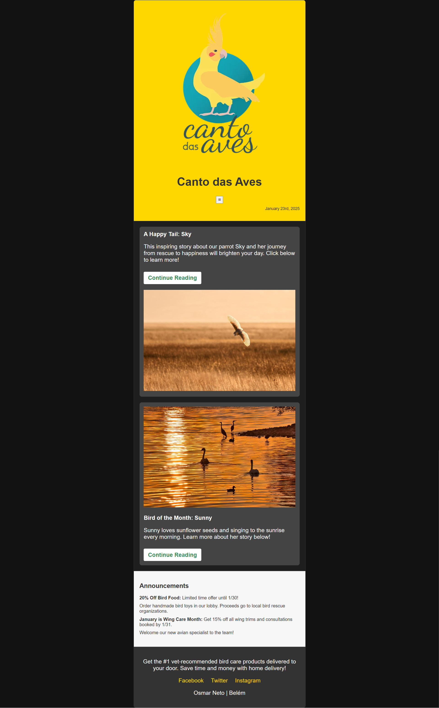

# Exercicio Less
Neste exercício você deverá:
1. Converter o estilo do projeto disponibilizado no Material de apoio para o LESS;

2. Utilizar os recursos do LESS que aprendeu durante o módulo:
    + variáveis;
    + divisão dos arquivos;
    + escapings;
    + mapas.

## Preview da página

>>>>>>> 53a5a77 (Tradução para LESS)
