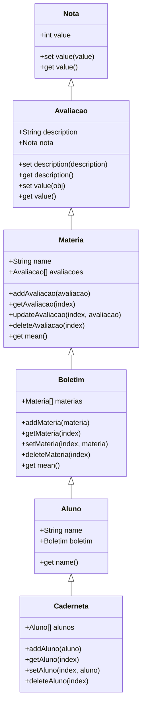

# Exercicio ES6
## Objetivos

• Cria um array de objetos, onde teremos como atributos do objeto: o nome e a nota de alunos;

> Atingi esse objetivo atravas da implementacao da classe `Caderneta` a qual tem uma array de `Aluno`


• Criar uma função que irá retornar apenas os alunos que tiveram a nota maior ou igual à 6;

> Modifiquei um pouco a implementacao do filtro, cada `Materia` possui um array de `Avaliacao`, então nesso código filtrei as matérias em duas categorias, aprovado e reprovado, com base na média.

## Exemplo de Saida Esperada

```
João:
        Aprovado:
                - Português: 7.00
                - Geografia: 8.50
                - História: 7.50
                - Ciências: 7.50
        Reprovado:
                - Matemática: 5.50


Maria:
        Aprovado:
                - Português: 9.00
                - Geografia: 8.50
                - Ciências: 9.00
        Reprovado:
                - Matemática: 5.50
                - História: 5.50


José:
        Aprovado:
                - Português: 7.00
                - Matemática: 6.00
                - Geografia: 8.00
                - História: 6.00
                - Ciências: 7.00
        Reprovado:

```

## Diagrama de Classes




## Codigo Main.js

```
import { Caderneta } from "./caderneta.js";
import { Aluno } from "./aluno.js";
import { Materia } from "./materia.js";
import { Avaliacao } from "./avaliacao.js";

// Caderneta
const caderneta = new Caderneta();

// Alunos
const alunos = [
    new Aluno("João"),
    new Aluno("Maria"),
    new Aluno("José")
];

// Materias
const materias = [
    new Materia("Português"),
    new Materia("Matemática"),
    new Materia("Geografia"),
    new Materia("História"),
    new Materia("Ciências")
];

// Avaliações
const avaliacoes = [
    "Avaliação 1",
    "Avaliação 2",
];

// Gerando dados
function gerarDados() {
    alunos.forEach(aluno => {
        const boletim = aluno.boletim;
        materias.forEach(materiaBase => {
            const materia = new Materia(materiaBase.name);
            avaliacoes.forEach(avaliacaoNome => {
                const av = new Avaliacao(avaliacaoNome, Math.floor(Math.random() * (10 - 5 + 1)) + 5);
                materia.addAvaliacao(av);
            });
            boletim.addMateria(materia);
        });
        caderneta.addAluno(aluno);
    });
}

gerarDados();

// Filtrando matérias
function filtrarMaterias(aluno) {
    const materiasAprovado = aluno.boletim.materias.filter(materia => materia.mean >= 6);
    const materiasReprovado = aluno.boletim.materias.filter(materia => materia.mean < 6);

    return `
        ${aluno.name}:
        \tAprovado:
        ${materiasAprovado.map(materia => `\t\t- ${materia.name}: ${materia.mean}`).join("\n\t")}
        \tReprovado:
        ${materiasReprovado.map(materia => `\t\t- ${materia.name}: ${materia.mean}`).join("\n\t")}
    `;
}

caderneta.alunos.forEach(aluno => console.log(filtrarMaterias(aluno)));

```


