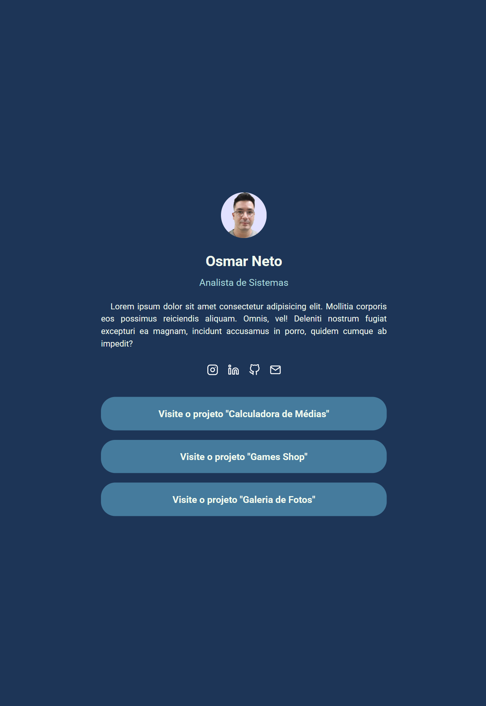

<<<<<<< HEAD
# Desenvolvedor Full Stack Java v2 - Módulo Front-End

Esse repositório destina-se a armazenar as atividades práticas do módulo front-end do curso full stack da EBAC.

## Tópicos abordados

[X] Git & GitHub  
[X] Html  
[X] Css  
[X] VERCEL  
[X] Javascript (JS)  
[X] Jquery  
[ ] BootStrap  
[ ] Sass  
[ ] Gulp  
[ ] Less  
[ ] Grunt  
[ ] Ajax & XHTML  
[ ] JS POO  
[ ] JS ES6+  
[ ] TypeScript  
[ ] Vue.js  
[ ] React  
[ ] Redux  
[ ] Cypress
=======
# Exercicio Less
Neste exercício você deverá:
1. Converter o estilo do projeto disponibilizado no Material de apoio para o LESS;

2. Utilizar os recursos do LESS que aprendeu durante o módulo:
    + variáveis;
    + divisão dos arquivos;
    + escapings;
    + mapas.

## Preview da página

>>>>>>> 53a5a77 (Tradução para LESS)
